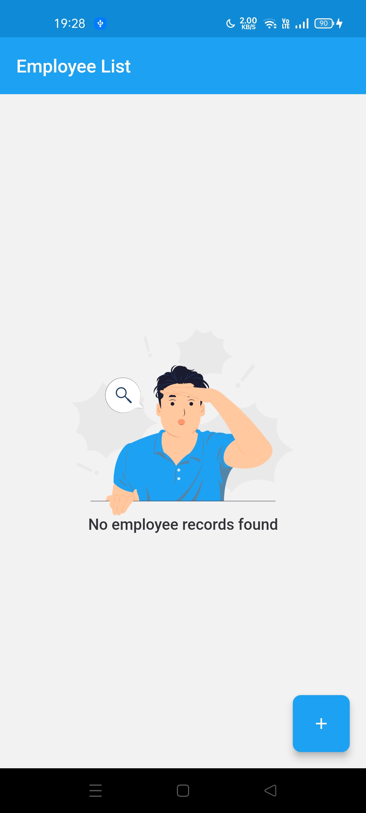
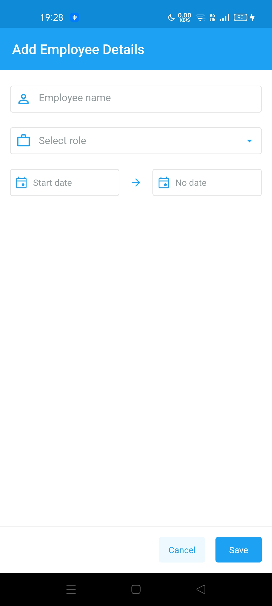
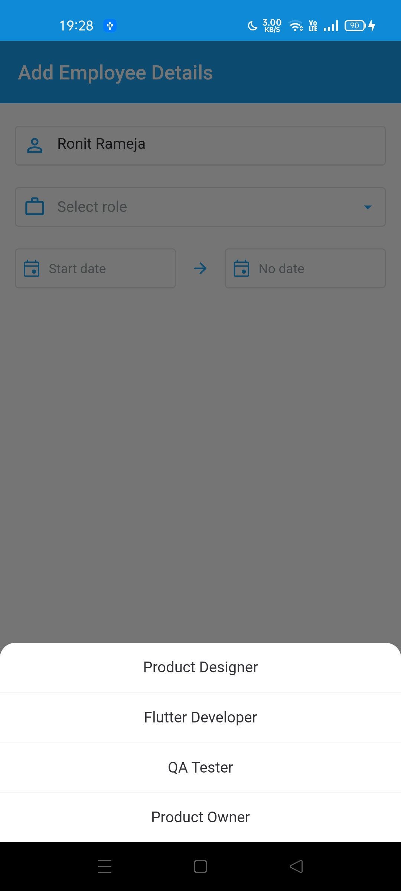
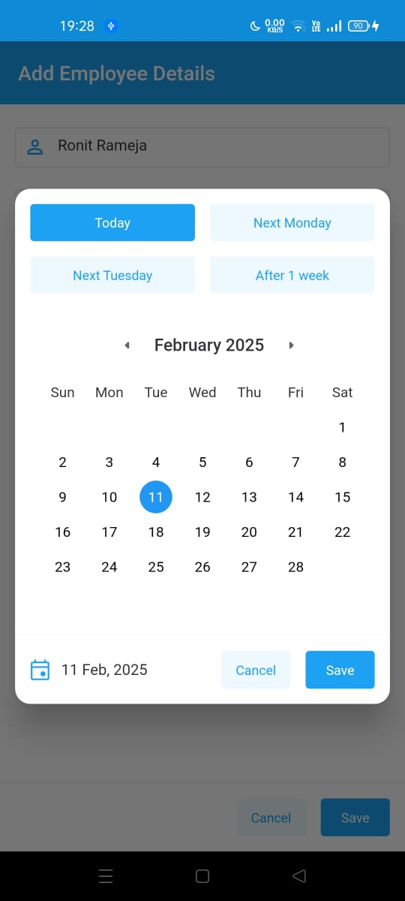
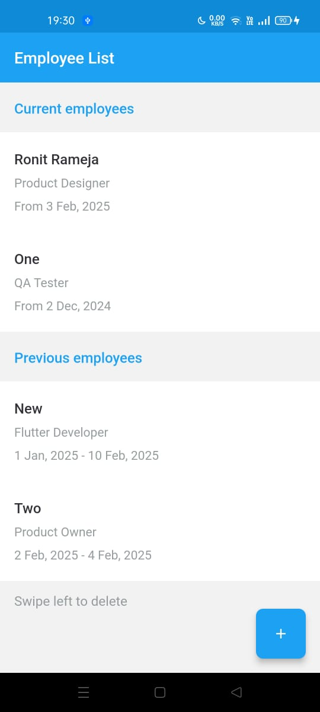
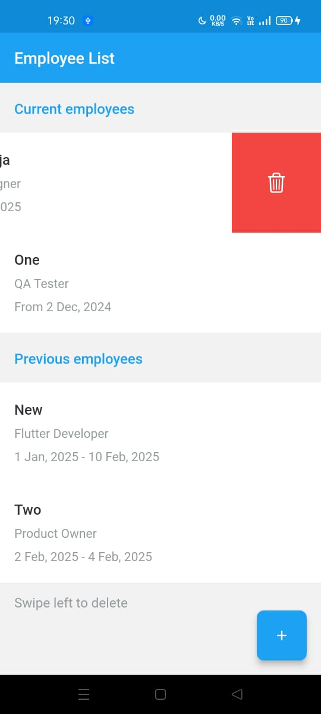
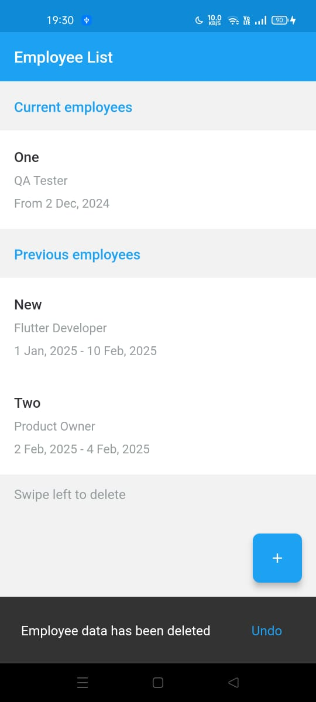

# Employee Management App

A Flutter application for managing employee records with offline storage capabilities.

## Features

- Create, Read, Update, and Delete (CRUD) operations for employee records
- Offline data persistence using Hive database
- BLoC pattern for state management
- Responsive UI design with Flutter ScreenUtil
- Custom date picker and form validation
- Slidable list items for quick actions

## Tech Stack

- **Flutter**: UI framework
- **Hive**: Local database
- **flutter_bloc**: State management
- **flutter_screenutil**: Responsive design

## Project Structure
```
lib/ 
├── src/ 
│ ├── bloc/ # Business Logic Components 
│ ├── config/ # App configurations 
│ ├── data/ # Data layer and repositories 
│ ├── models/ # Data models 
│ ├── screens/ # UI screens 
│ └── widgets/ # Reusable widgets 
└── main.dart # Entry point
```
## Screenshots

<div style="display: flex; flex-wrap: wrap; gap: 10px; justify-content: center;">
    
    
    
    
    
    
    
</div>

